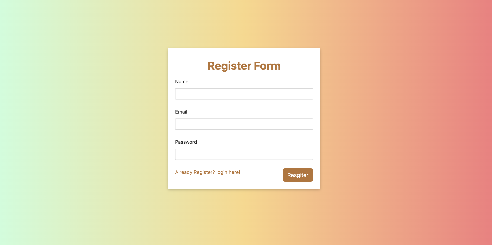

# ExpenseTrack

Authentication and Authorization features to ensure secure access and protect sensitive financial data from unauthorized access & Streamlined access to personal financial management dashboard for a seamless login experience.

Employed MongoDB for data storage, leveraging its NoSQL capabilities to efficiently manage and retrieve information.

React.js for the front end components

## Deployment

To deploy this project
clone it and run both client and server files concurrently using the concurrently package.

```bash
  npm run dev
```

## Screenshots

Login Page :


Register Page :


Home Page :


Home page with antd icons :


## Installation

Install all the dependencies and packages using

```bash
  npm install
```

do it for both client and server package.json files

## MERN Stack

The MERN stack is a powerful and popular collection of technologies used to build modern web applications. It provides a full-stack development solution, meaning it covers all aspects of an application, from the user interface to the data layer. The beauty of MERN lies in its focus on JavaScript, allowing developers to use a single language throughout the entire development process. Here's a deeper dive into each technology:

- **MongoDB:** A NoSQL document database, known for its flexibility and scalability. Unlike traditional relational databases, MongoDB stores data in JSON-like documents, allowing for a more natural representation of complex data structures. This makes it ideal for storing and retrieving data used in modern web applications.

- **Express.js:** A lightweight web framework built on top of Node.js. It simplifies the process of creating web servers and APIs by providing a robust set of features for handling HTTP requests, routing, middleware, and more. Express allows developers to focus on building the core functionality of their application without getting bogged down in low-level server details.

- **React.js:** A popular JavaScript library for building dynamic and interactive user interfaces (UI). React uses a component-based approach, where complex UIs are broken down into smaller, reusable components. This promotes code reusability, maintainability, and easier collaboration among developers. React also employs a virtual DOM, which significantly improves the performance of web applications by optimizing UI updates.

- **Node.js:** An open-source, cross-platform JavaScript runtime environment that allows developers to execute JavaScript code outside of a web browser. This means you can use JavaScript for both server-side and client-side development. Node.js is known for its asynchronous and event-driven architecture, making it efficient at handling multiple concurrent requests.

The combination of these technologies allows developers to build robust, scalable, and feature-rich web applications with a focus on code reusability and a streamlined development process.

## Environment Variables

To run this project, you will need to add the following environment variables to your .env file

`MONGO_URL` (create a database cluster in mongodb cloud)

`PORT` 8080 (for server) 3000 (for client)

## Authors

- [@Raj Kumar Rai](https://www.github.com/raj2208)

## Contributing

Contributions are always welcome!
